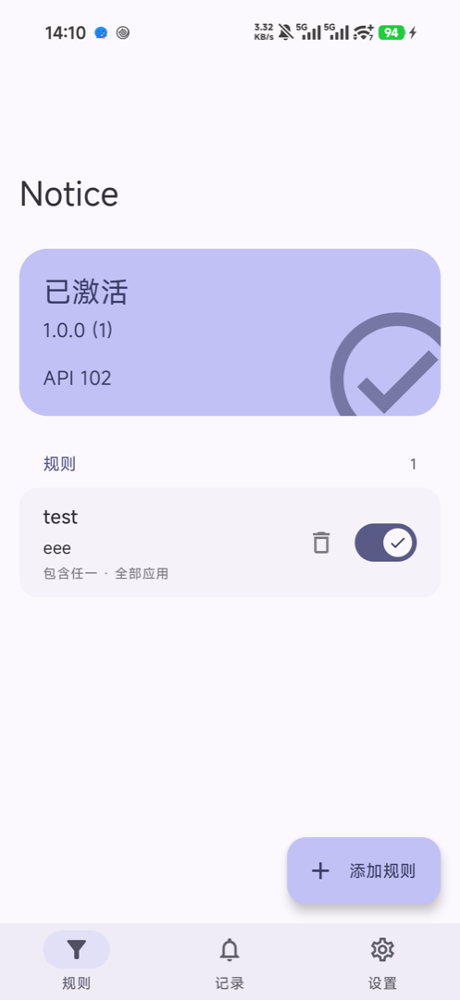
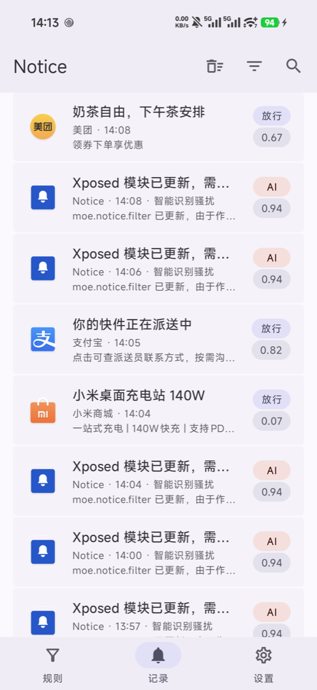
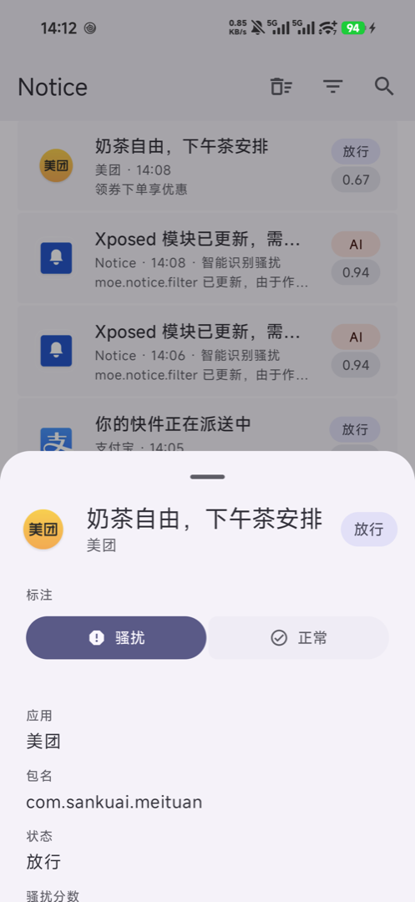
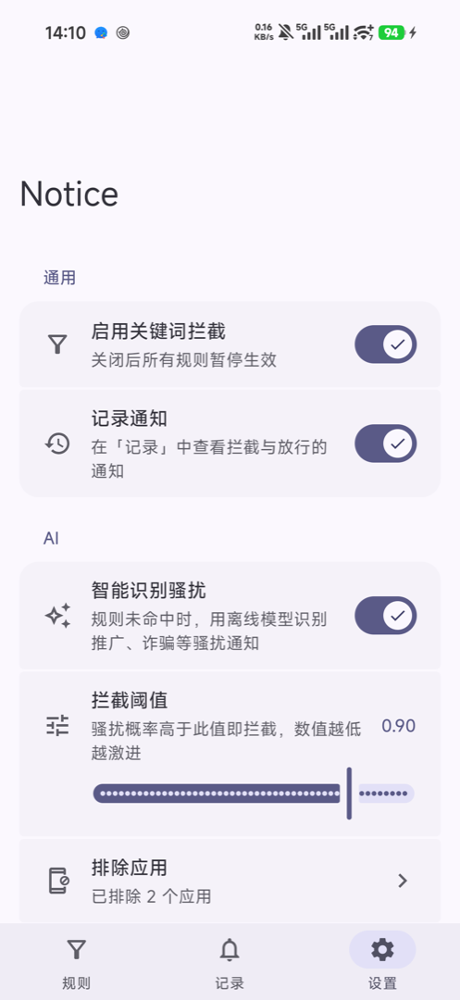
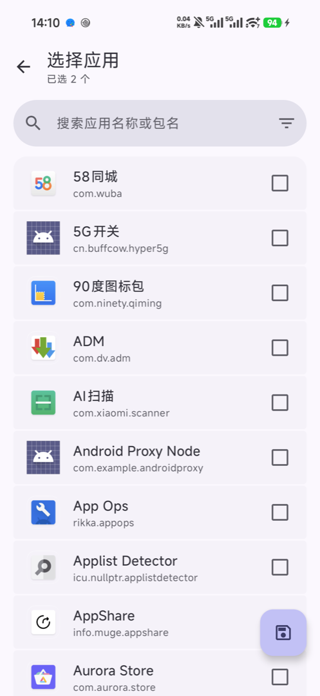

# Notice

基于 LSPosed 的通知过滤模块，Hook `system_server` 拦截不想看到的通知。  
支持关键词 / 正则规则和**完全离线的 AI 骚扰识别**，支持手动标注微调。  
**注意：该应用完全由 AI 生成，是否安装请自行判断。**

**目前仅在红米 K90 上测试，功能正常。**

## 界面


| 规则                                   | 记录                                  | 记录详情                                        |
| :------------------------------------: | :-----------------------------------: | :-------------------------------------------: |
|  |  |  |


| 设置                                      | 选择应用                                        |
| :---------------------------------------: | :-------------------------------------------: |
|  |  |


## 功能

**规则拦截**

- 多条规则，每条可设置：包含任一 / 包含全部 / 不包含 / 包含 A 且不含 B / 正则 / 全部内容。
- 按应用限定范围（白名单或黑名单），单条规则可随时开关。

**AI 骚扰识别**

- 内置一个 256 KB 的文本分类模型，纯 Kotlin 推理，运行在 `system_server` 内，无网络请求。
- 规则未命中时对通知打分，分数 ≥ 阈值即拦截；阈值 0.50–0.99 可调（默认 0.90）。
- 含验证码 / verification code / OTP 等字样的通知**永远不会被模型拦截**。
- 可以设置排除指定应用。

**端侧微调**

- 在记录详情里把通知标为「骚扰」或「正常」，App 会立即在本地重新拟合一个叠加在内置模型上的稀疏修正量，并推送给 `system_server` 。
- 一键清除标注即可恢复内置模型。数据不出设备。

**记录**

- 记录每条通知的拦截结果、命中规则、骚扰分数和完整的通知字段。
- 按拦截 / 放行 / AI 筛选，按应用多选筛选，全文搜索。
- 下载进度条等同一条通知的反复更新会合并成一条，显示更新次数。

## 环境要求

- Android 10（API 29）及以上。
- 支持 **libxposed 新版 API（API 100+）** 的框架，例如 LSPosed 的新 API 版本；旧版 `XposedBridge` API 不支持。
- 作用域为**系统框架（`system`）**，由模块静态声明，无需手动勾选。
- 通话、闹钟、导航、媒体、前台服务通知始终放行。

## 安装与使用

1. 安装 APK，在 LSPosed 中启用模块，重启手机。
2. 打开 Notice，「规则」页顶部显示「已激活」即表示注入成功。
3. 「设置 → 通用」打开「启用关键词拦截」；在「规则」页添加规则。
4. 「设置 → AI」打开「智能识别骚扰」，先用默认阈值观察几天「记录」里的分数，有误杀就调高阈值。
5. 遇到判断错误的通知，在记录详情里标注「骚扰」/「正常」，模型会随之学习。

> 修改设置立即生效，不需要重启；只有更新模块本身需要重启手机。

## AI 模型说明

模型是一个字符 n-gram（1–3 gram）哈希特征上的 Logistic Regression：

- 特征：归一化（小写、去空白、去数字、去字母 `x`）后的 UTF-16 字符 n-gram，用 FNV-1a 哈希到 2^18 个桶，L2 归一化。Python 训练侧和 Kotlin 推理侧的实现逐位一致，由单元测试用 `parity.json` 校验。
- 训练数据：约 8.8k 条带人工判定的**真实 App 通知**（导入的 CSV，个人数据，不在仓库中，样本权重 ×30）+ 公开中文短信语料中的 10 万条**正常**短信作为额外负样本（校准先验，避免把陌生文本一律往骚扰判）。
- 真实通知留出集（20%）表现：阈值 0.80 时 precision ≈ 0.97 / recall ≈ 0.74；阈值 0.90 时 precision ≈ 0.98 / recall ≈ 0.67。
- 权重 int8 量化，模型文件 `app/src/main/resources/model/spam_v1.bin`。

已知局限：训练数据来自一台设备上安装的应用，其它类型应用的通知可能覆盖不足；4 个字以内的文本不参与判定。端侧微调可以针对自己的通知继续修正。

重新训练：

```bash
cd ml
uv run train.py --extra data/你的通知判定.csv --sms-ham-only --limit 100000 --extra-weight 30 --C 10   # 内置模型的训练参数
uv run train.py                                                             # 仅用公开短信语料（会自动下载）
uv run --group dev pytest -q
```

训练脚本会重新生成模型文件和 `app/src/test/resources/model/parity.json`。详见 [ml/README.md](ml/README.md)。

## 构建

```bash
export JAVA_HOME="/Applications/Android Studio.app/Contents/jbr/Contents/Home"   # 或任意 JDK 17+
export ANDROID_HOME="$HOME/Library/Android/sdk"
sh ./gradlew :app:testDebugUnitTest :app:assembleDebug
```

产物在 `app/build/outputs/apk/debug/app-debug.apk`。

## 项目结构

```
app/src/main/java/moe/notice/filter/
├── xposed/        # system_server 侧：hook、规则匹配、AI 打分、日志上报
├── domain/        # 纯 Kotlin：规则模型、SpamFeatures / SpamModel / SpamJudge / SpamTuner
├── data/          # 配置与日志的编解码、标注存储、微调结果下发
├── provider/      # 接收 system_server 日志的 ContentProvider
└── ui/            # Compose（Material 3 Expressive）界面
app/src/main/resources/
├── META-INF/xposed/   # libxposed 模块声明与静态作用域
└── model/             # 内置分类模型
ml/                    # 模型训练管线（uv + scikit-learn）
docs/                  # 设计文档与截图
```

## 致谢

- [libxposed](https://github.com/libxposed) / [LSPosed](https://github.com/LSPosed/LSPosed)
- 中文垃圾短信数据集：[hrwhisper/SpamMessage](https://github.com/hrwhisper/SpamMessage)
- [SMS Spam Collection](https://archive.ics.uci.edu/dataset/228/sms+spam+collection)

